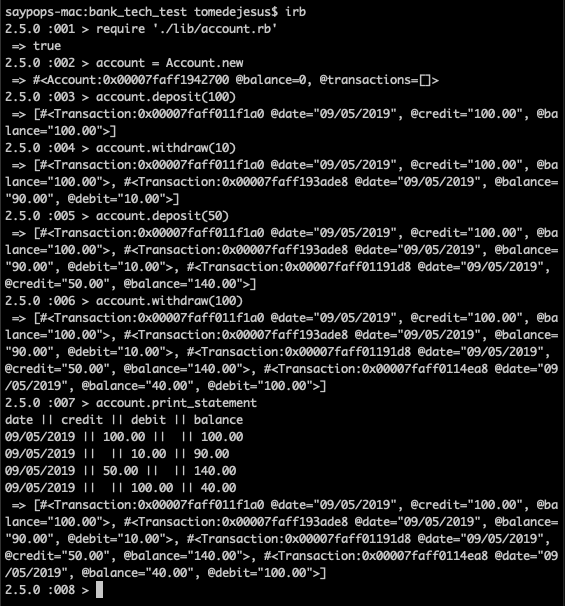

# Bank tech test

### Objectives
1. TDD
2. Maximum test coverage
3. Readability
4. Problem Solving

### Instructions
1. `git clone https://github.com/saypop/bank_tech_test.git`
2. `bundle install`
2. `cd bank_tech_test`
3. `irb` then:

### Testing
`rspec`

## Approach

1. Write user stories:

    `As a client of a bank
    So that I can add money to my account
    I can make a deposit`

    `As a client of a bank
    So that I can use my money
    I can make a withdrawal`

    `As a client of a bank
    So that I can see a record of my transactions
    I can print out a statement`

2. Domain modelling:

    

3. Write feature tests.
    - Open account;
    - Print blank statement;
    - Make deposit and print statement;
    - Make withdrawal and print statement.

4. Write tests for Account Class:
    - initialises with balance of 0;
    - initialises with a statement;
    - has a deposit method that increases the balance;
    - has a deposit method that stores the transaction;
    - has a withdraw method that decreases the balance;
    - has a withdraw method that stores the transaction;
    - has a withdraw method that raises an error when funds are insufficient.

3. Write tests for Statement Class:
    - initialises with an blank statement;
    - stores transactions.

4. Write tests for Transaction Class:
    - initialises with date, credit, debit, and balance attributes.
