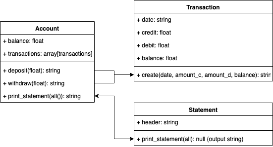

# Bank tech test

### Objectives
1. TDD
2. Maximum test coverage
3. Readability

### Instructions
1. `git clone https://github.com/saypop/bank_tech_test.git`
2. `bundle install`
2. `cd bank_tech_test`
3. `irb` then:

`
2.5.0 :001 > require './lib/account.rb'
 => true
2.5.0 :002 > account = Account.new
 => #<Account:0x00007fd9b391a048 @balance=0, @statement=#<Statement:0x00007fd9b391a020 @printout=["date || credit || debit || balance"]>>
2.5.0 :003 > account.deposit(1000)
 => ["date || credit || debit || balance", "08/05/2019 || 1000.0 ||  || 1000.0"]
2.5.0 :004 > account.withdraw(100)
 => ["date || credit || debit || balance", "08/05/2019 || 1000.0 ||  || 1000.0", "08/05/2019 ||  || 100.0 || 900.0"]
2.5.0 :005 > account.withdraw(150)
 => ["date || credit || debit || balance", "08/05/2019 || 1000.0 ||  || 1000.0", "08/05/2019 ||  || 100.0 || 900.0", "08/05/2019 ||  || 150.0 || 750.0"]
2.5.0 :006 > account.print_statement
date || credit || debit || balance
08/05/2019 || 1000.0 ||  || 1000.0
08/05/2019 ||  || 100.0 || 900.0
08/05/2019 ||  || 150.0 || 750.0
`

### Testing
`rspec`

## Approach

1. Write user stories:

    `As a client of a bank
    So that I can add money to my account
    I can make a deposit`

    `As a client of a bank
    So that I can use my money
    I can make a withdrawal`

    `As a client of a bank
    So that I can see a record of my transactions
    I can print out a statement`

2. Domain modelling:
    

3. Write tests for Account Class:
    - initialises with balance of 0;
    - initialises with a statement;
    - has a deposit method that increases the balance;
    - has a deposit method that stores the transaction;
    - has a withdraw method that decreases the balance;
    - has a withdraw method that stores the transaction;
    - has a withdraw method that raises an error when funds are insufficient.

3. Write tests for Statement Class:
    - initialises with an blank statement;
    - stores transactions.

4. Write tests for Transaction Class:
    - initialises with date, credit, debit, and balance attributes.

5. Write feature tests.
